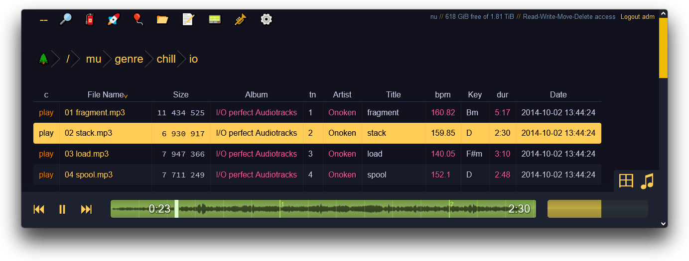

# copyparty

<!-- Describes what this module does -->

This module installs Copyparty, an alternative to Filebrowser.
[Copyparty](https://github.com/9001/copyparty) is a portable file server with accelerated resumable uploads, dedup, WebDAV, FTP, TFTP, zeroconf, media indexer, thumbnails++ all in one file, no deps

```tf
module "copyparty" {
  count   = data.coder_workspace.me.start_count
  source  = "registry.coder.com/djarbz/copyparty/coder"
  version = "1.0.0"
}
```

<!-- Add a screencast or screenshot here  put them in .images directory -->



## Examples

### Example 1

Some basic command line options:

```tf
module "copyparty" {
  count    = data.coder_workspace.me.start_count
  source   = "registry.coder.com/djarbz/copyparty/coder"
  version  = "1.0.0"
  agent_id = coder_agent.example.id
  arguments = [
    "-v", "/home/coder/:/home:r",       # Share home directory (read-only)
    "-v", "${local.repo_dir}:/repo:rw", # Share project directory (read-write)
    "-e2dsa",                           # Enables general file indexing"
  ]
}
```

### Example 2

```tf
module "copyparty" {
  count     = data.coder_workspace.me.start_count
  source    = "registry.coder.com/djarbz/copyparty/coder"
  version   = "1.0.0"
  agent_id  = coder_agent.example.id
  subdomain = true
  arguments = [
    "-v", "/tmp:/tmp:r",                         # Share tmp directory (read-only)
    "-v", "/home/coder/:/home:rw",               # Share home directory (read-write)
    "-v", "${local.root_dir}:/work:A:c,dotsrch", # Share work directory (All Perms)
    "-e2dsa",                                    # Enables general file indexing"
    "--re-maxage", "900",                        # Rescan filesystem for changes every SEC
    "--see-dots",                                # Show dotfiles by default if user has correct permissions on volume
    "--xff-src=lan",                             # List of trusted reverse-proxy CIDRs (comma-separated) or `lan` for private IPs.
    "--rproxy", "1",                             # Which ip to associate clients with, index of X-FWD IP.
  ]
}
```
